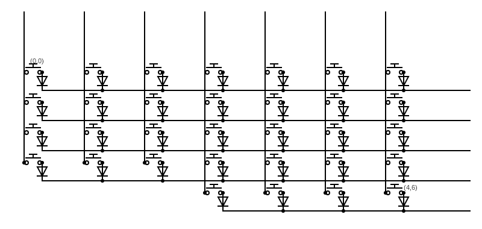
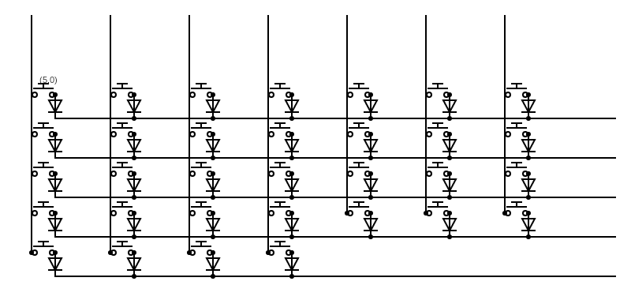

# Custom Keyboard Build  

This repository documents the creation of my custom split keyboard, covering the entire process from design to firmware development.  

## 🔧 Features  
- **Hand-wired** custom layout  
- **QMK firmware** for firmware build  
- **Split keyboard design** for ergonomics  
- **Custom case**  

## 📂 Repository Contents  
- 📝 **Documentation** – Switch plate iterations, design choices, and wiring diagram
- 🔧 **Firmware** – QMK configuration files and keymaps  
- 🎨 **Case Design** – Custom case options  

## 🛠 Tools & Components  
- **Microcontroller**: your choice of RP2040 based microcontroller  
- **Firmware**: QMK/VIA/Vial  
- **Diodes**: 1N4148 (number depends on amount of keys used) - Used to prevent "ghosting" by ensuring current flows in one direction through the switch matrix
- **MX switches**: PCB mount or plate mount compatible 

## 📝 Notes & Future Plans  
- Adding **VIA/Vial compatibility**  
- Designing **face plate and case to utilize full size of matrix**
- Designing a **PCB version**  

## 📷 Wiring Diagram

readme and repository are still under construction. please be patient. Thank you !
